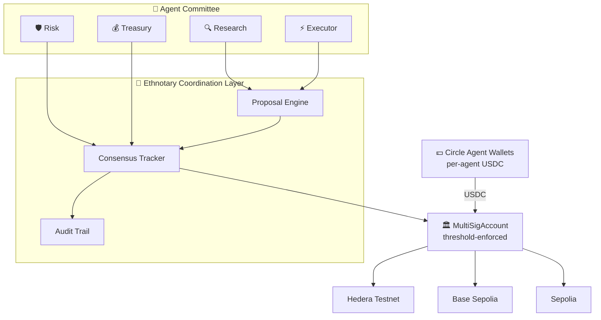

# Ethnotary — Multi-Agent Treasury Coordination

> **Consensus-driven treasury infrastructure for autonomous AI agents.**

[](./HACKATHON.md)
[](./HACKATHON.md)
[](./HACKATHON.md)
[](./LICENSE)

## The Problem

Today's agentic-payment stacks give **one AI agent one wallet** and trust it to spend autonomously. That model is brittle:

- **Single point of failure** — one prompt-injection or compromised key drains the treasury.
- **No governance** — autonomous decisions execute without review.
- **Poor auditability** — agents reason opaquely; on-chain receipts have no decision context.

## The Solution

**Ethnotary turns multi-signature contracts into governance rails for AI agent committees.** Specialized agents — Research, Risk, Treasury, Executor — propose, evaluate, and vote on every transaction. Threshold approval is enforced **on-chain** by audited multi-sig contracts, and every decision is captured in an append-only audit trail.

The result: **autonomous capital, with governance.**

## Architecture



> Full diagram + flow walkthrough → [`docs/architecture.md`](./docs/architecture.md)

## Run the demo in 60 seconds

```bash
git clone https://github.com/ethnotary/ethnotary-cli.git && cd ethnotary-cli
npm install
cp .env.example .env                         # fill in PRIVATE_KEY (or run `ethnotary wallet init`)

# Deploy a multi-sig (any supported EVM network — Hedera Testnet shown)
npx ethnotary create --owners <your-address> --required 1 --pin 1234 \
  --name joy --network hedera-testnet

# Edit demo/config.json with your alias + recipient, then:
node demo/agent-committee.js
```

You'll see four agents convene, debate, vote 3/3 to approve, and settle a transaction on-chain. The full session — proposal, votes, confidence scores, transaction hash — is appended to `demo/audit-trail.json`.

## Track Alignment

### 🟣 Hedera Agent Kit

- ✅ Agents move value autonomously on **Hedera Testnet** (chain ID 296) via the JSON-RPC relay
- ✅ Multi-agent negotiation — Research → Risk → Treasury → Executor flow
- ✅ Public repo + demo video + ≤5-min walkthrough
- ✅ Settlement is real on-chain HBAR/ERC-20 transfer through the Ethnotary multi-sig

### 🔵 Circle Agent Stack

- ✅ Per-agent capital via **Circle Developer-Controlled Wallets** ([`demo/circle-funder.js`](./demo/circle-funder.js))
- ✅ Autonomous commerce — agents fund the shared treasury with USDC, then collectively spend
- ✅ Architecture diagram showing how Circle wallets feed the consensus-controlled treasury
- ✅ Real USDC settlement on Base Sepolia

→ Full track-by-track judge map: [`HACKATHON.md`](./HACKATHON.md)

## Example Use Cases

- **Prediction market treasury** — agents detect mispriced odds, vote to allocate, settle on-chain
- **AI compute marketplace** — agents pay per query / per inference under risk-budgeted spending caps
- **DAO treasury automation** — committee of specialized agents replaces slow multi-sig council reviews
- **Agent-to-agent payments** — settled through governed treasuries instead of trusted single wallets

---

## CLI Reference

A command-line protocol for managing multi-signature wallets across EVM networks. Built for teams, DAOs, and AI agents who need secure, collaborative control over on-chain treasuries.

**Key capabilities:**
- **Treasury Management** – Collaboratively manage funds with multi-sig approval workflows
- **Payment Collection** – Receive and track payments across multiple networks
- **AI Agent Integration** – Enable AI agents to submit transactions while humans (or other agents) retain approval authority
- **Cross-Chain Operations** – Deploy and manage the same wallet on Sepolia, Base Sepolia, Hedera Testnet, and more

With multi-signature approvals, every transaction requires consensus — keeping the treasury in control while enabling automation and agent collaboration.

## How Multi-Signature Works

A multi-signature (multi-sig) wallet requires multiple approvals before a transaction can execute. You define the number of **owners** and how many **confirmations** are required.

**Common Configurations:**

| Setup | Use Case |
|-------|----------|
| **1 of 1** | Single owner, instant execution. Good for personal wallets or AI agents with full autonomy. |
| **1 of 2** | Either owner can approve. Useful for shared access (e.g., you + your AI agent). |
| **2 of 2** | Both owners must approve. Maximum security for two-party agreements. |
| **2 of 3** | Any 2 of 3 owners must approve. Balances security with availability—if one key is lost, funds are still accessible. |
| **3 of 5** | Majority approval for DAOs or teams. Prevents single points of failure. |

**Example: AI Agent Integration (1 of 2)**
```
Owners: [Your Wallet, AI Agent Wallet]
Required: 1

→ AI agent can submit AND execute transactions autonomously
→ You can also execute transactions when needed
```

**Example: Human Oversight (2 of 2)**
```
Owners: [Your Wallet, AI Agent Wallet]
Required: 2

→ AI agent submits transactions
→ You review and approve before execution
→ Nothing happens without your confirmation
```

## Prerequisites

- **Node.js** (v16 or higher) - [Download](https://nodejs.org/)
- **npm** (comes with Node.js)
- **RPC URL** – Connection to your target network (e.g., from [Infura](https://infura.io), [Alchemy](https://alchemy.com), or a public RPC)
- **ETH for gas** – Enough cryptocurrency on your target network to pay for transaction fees

Verify Node.js installation:
```bash
node --version  # Should show v16.x.x or higher
npm --version   # Should show 8.x.x or higher
```

## Installation

```bash
# Install globally from npm
npm install -g ethnotary
```

## Quick Start

```bash
# Generate a new wallet
ethnotary wallet init

# Create a MultiSig account (auto-saved with name as alias)
ethnotary account create \
  --owners 0x123...,0x456... \
  --required 2 \
  --pin 1234 \
  --name treasury

# Switch to the account
ethnotary checkout treasury

# Check account info (uses active contract)
ethnotary account info

# Submit a transaction
ethnotary tx submit --dest 0x789... --value 0.1

# List pending transactions
ethnotary data pending
```

## Global Options

All commands support these global flags:

| Flag | Description |
|------|-------------|
| `--json` | Output in JSON format (machine-readable, no prompts) |
| `--private-key <key>` | Use this private key directly |
| `--network <name>` | Network to use (default: `sepolia`) |
| `--yes` | Skip all confirmation prompts |
| `--dry-run` | Simulate without executing |

## Commands

### Wallet Management

```bash
ethnotary wallet init       # Generate new wallet, save encrypted keystore
ethnotary wallet import     # Import existing key/mnemonic
ethnotary wallet show       # Display wallet address
```

## Wallet Security

Your private keys **never leave your machine**. Ethnotary stores wallet credentials locally in an encrypted keystore file, protected by a password you choose.

**Wallet Priority:**
1. `--private-key` flag – Explicit override for single commands
2. **Encrypted keystore** – Default, password-protected (recommended)
3. `PRIVATE_KEY` env var – Fallback for scripts/automation

```bash
# Create a new encrypted wallet (stored locally)
ethnotary wallet init

# View your wallet address
ethnotary wallet show
```

**What stays on your machine:**
- Private keys (encrypted in keystore)
- Wallet passwords (never stored, prompted each time)
- RPC URLs and API keys (in `~/.ethnotary/config.json`)

**What goes on-chain:**
- Only signed transactions you explicitly submit
- Your public address (visible in transactions)
### Account Management

Account management commands apply changes across ALL networks the contract is deployed on.
If a change fails on some networks, the account becomes "decoupled" and a warning is shown.

```bash
ethnotary account create    # Deploy new MultiSig
  --owners <address,address,...>   # Comma-separated owner addresses
  --required <number>              # Required confirmations
  --pin <number>                   # PIN for account management
  --name <text>                    # Account name (used as alias)
  --network <name,name,...>        # Network(s) to deploy to

ethnotary account info      # Show owners, required confirmations, balance
ethnotary account owners    # List owners
ethnotary account add       # Add owner (applies to all networks)
  --owner <address>                # New owner address
  --pin <number>                   # PIN for verification
  --force                          # Proceed even if pre-flight check fails

ethnotary account remove    # Remove owner (applies to all networks)
  --owner <address>                # Owner to remove
  --pin <number>                   # PIN for verification
  --force                          # Proceed even if pre-flight check fails

ethnotary account replace   # Replace owner (applies to all networks)
  --old <address>                  # Current owner address
  --new <address>                  # New owner address
  --pin <number>                   # PIN for verification
  --force                          # Proceed even if pre-flight check fails

ethnotary account status    # Check sync status across all networks
ethnotary account sync      # Re-sync decoupled accounts
  --pin <number>                   # PIN for authentication
  --dry-run                        # Preview changes without applying
```

### Transaction Management

Transaction commands require specifying a network. If not provided, you'll be prompted to select from the contract's configured networks.

```bash
ethnotary tx submit         # Submit transaction
  --dest <address>                 # Destination address
  --value <ether>                  # ETH amount (e.g., 0.1)
  --data <hex>                     # Optional calldata
  --network <name>                 # Target network (prompts if not specified)

ethnotary tx confirm        # Confirm transaction
  --txid <number>                  # Transaction ID
  --network <name>                 # Target network

ethnotary tx execute        # Execute confirmed transaction
  --txid <number>                  # Transaction ID
  --network <name>                 # Target network

ethnotary tx revoke         # Revoke confirmation
  --txid <number>                  # Transaction ID
  --network <name>                 # Target network

ethnotary tx pending        # List pending transactions
  --network <name>                 # Target network

ethnotary tx notify         # Get notification payload
  --txid <number>                  # Transaction ID
  --network <name>                 # Target network

ethnotary tx link           # Generate approval URL
  --txid <number>                  # Transaction ID
  --network <name>                 # Target network

ethnotary tx transfer-erc20 # Transfer ERC20 token
  --token <address>                # Token contract address
  --to <address>                   # Recipient address
  --amount <number>                # Token amount
  --network <name>                 # Target network

ethnotary tx transfer-nft   # Transfer NFT
  --token <address>                # NFT contract address
  --to <address>                   # Recipient address
  --tokenid <number>               # Token ID
  --network <name>                 # Target network
```

### Data Queries

Data queries pull from ALL networks the contract is deployed on by default. Use `--network` to filter to a specific network.

```bash
ethnotary data balance      # Get balance across all networks
  --network <name>                 # Filter to specific network (optional)

ethnotary data events       # Get events across all networks, sorted by time
  --limit <number>                 # Number of events per network (default: 10)
  --from-block <number>            # Start from block number
  --network <name>                 # Filter to specific network (optional)

ethnotary data pending      # Get pending transactions across all networks
  --network <name>                 # Filter to specific network (optional)

ethnotary data tokens       # Get token holdings across all networks
  --network <name>                 # Filter to specific network (optional)
```

### Contract Management

Switch between saved contracts (like git branches):

```bash
ethnotary create            # Deploy new MultiSig (same as account create)
  --owners <addr1,addr2,...>       # Comma-separated owner addresses
  --required <number>              # Required confirmations
  --pin <number>                   # PIN for account management
  --name <text>                    # Account name (used as alias)
  --network <name,name,...>        # Network name(s), comma-separated
  --chain-id <id,id,...>           # Or chain ID(s), comma-separated

ethnotary checkout <alias>  # Switch to a contract (sets as active)
ethnotary status            # Show current active contract
ethnotary list              # List all saved contracts

ethnotary add               # Save existing contract (validates on each network)
  --alias <text>                   # Alias for the contract
  --address <address>              # Contract address
  --network <name,name,...>        # Network name(s), comma-separated
  --chain-id <id,id,...>           # Or chain ID(s), comma-separated

ethnotary remove <alias>    # Remove a saved contract

# Multi-network examples:
ethnotary create --owners 0x...,0x... --required 2 --pin 1234 --name treasury \
  --network sepolia,base-sepolia,arbitrum-sepolia
# Creates: treasury-sepolia, treasury-base-sepolia, treasury-arbitrum-sepolia

ethnotary add --alias mywallet --address 0x123... \
  --chain-id 11155111,84532,421614
# Validates contract exists on each network, saves with network suffix
```

### Configuration

```bash
ethnotary config rpc [network]      # Add/update RPC URL
  --url <url>                      # RPC URL (optional, prompts if missing)

ethnotary config network [network]  # Add/update network
  --name <text>                    # Display name
  --chain-id <number>              # Chain ID
  --rpc <url>                      # RPC URL
  --testnet                        # Mark as testnet

ethnotary config show               # Show all config (RPC URLs, networks)
ethnotary config path               # Show config file paths
```

**Examples:**
```bash
# Set RPC URL directly
ethnotary config rpc sepolia --url https://sepolia.infura.io/v3/YOUR_KEY

# Interactive RPC setup (shows provider suggestions)
ethnotary config rpc base-sepolia

# Add a custom network
ethnotary config network soneium --name "Soneium" --chain-id 1868 --rpc https://rpc.soneium.org
```

## Authentication

The CLI supports multiple authentication methods (in priority order):

1. **`--private-key <key>`** - Direct key argument (agent-friendly)
2. **`PRIVATE_KEY` env var** - Environment variable (agent-friendly)
3. **Encrypted keystore** - Password prompt (human-friendly)

## Agent-Friendly Usage

For AI agents and automation, use `--json` and `--private-key`:

```bash
# Create account (no prompts)
ethnotary account create \
  --owners 0x123...,0x456... \
  --required 2 \
  --pin 1234 \
  --private-key $AGENT_PRIVATE_KEY \
  --name treasury \
  --network sepolia \
  --json --yes

# Output: {"address":"0x...","txHash":"0x...","network":"sepolia","alias":"treasury"}

# Use alias in subsequent commands
ethnotary tx pending --address treasury --json
ethnotary account info --address treasury --json
```

## Multi-Signature Approval Workflow (OpenClaw/ClawHub)

For MultiSig accounts requiring multiple confirmations, agents can request approvals from human co-owners via messaging platforms.

### Setup Owner Contacts

```bash
# Register contact info for each owner (one-time setup)
ethnotary contact add --address 0xHuman... --telegram 123456789 --whatsapp +15551234567
ethnotary contact list
```

### Agent Workflow

```bash
# 1. Agent submits transaction
ethnotary tx submit --dest 0xDEX... --value 0.5 --json --private-key $AGENT_KEY

# Returns:
# {
#   "transactionId": 5,
#   "approvalUrl": "https://ethnotary.io/app/demo/views/txn.html?5?sepolia",
#   "notifyOwners": [
#     {
#       "address": "0xHuman...",
#       "whatsapp": "+15551234567",
#       "telegram": "123456789",
#       "message": "🔔 MultiSig Approval Request\n\nTransaction #5..."
#     }
#   ],
#   "confirmations": "1/2",
#   "canExecute": false
# }

# 2. Agent uses OpenClaw's message tool to send WhatsApp/Telegram
#    (OpenClaw handles messaging via its Gateway)

# 3. Human receives message → clicks approval link → confirms on ethnotary.io

# 4. Agent polls for confirmation
ethnotary tx pending --json | jq '.transactions[] | select(.canExecute)'

# 5. Agent executes when fully confirmed
ethnotary tx execute --txid 5 --json --private-key $AGENT_KEY
```

### Notification Commands

```bash
ethnotary tx link --txid 5           # Generate approval URL only
ethnotary tx notify --txid 5 --json  # Get full notification payload for existing tx
```

### Contact Management

```bash
ethnotary contact add     # Add / update owner contact (--address, --telegram, --whatsapp, --email, --webhook)
ethnotary contact list    # List all contacts
ethnotary contact show    # Show contact for address
ethnotary contact remove  # Remove contact
```

## Configuration Files

All configuration is stored in `~/.ethnotary/`:

| File | Purpose |
|------|---------|
| `keystore.json` | Encrypted wallet (password-protected) |
| `contracts.json` | Saved contract addresses with aliases |
| `config.json` | General configuration |

## Networks

Supported networks (use `--network <name>` or `--chain-id <id>`):

**Currently Supported:**
| Network | Name | Chain ID |
|---------|------|----------|
| Sepolia | `sepolia` | 11155111 |
| Base Sepolia | `base-sepolia` | 84532 |

**Coming Soon:**
| Network | Name | Chain ID |
|---------|------|----------|
| Ethereum Mainnet | `ethereum` | 1 |
| Base | `base` | 8453 |
| Arbitrum One | `arbitrum` | 42161 |
| Optimism | `optimism` | 10 |
| Polygon PoS | `polygon` | 137 |
| *...and more* | | |

**Configure RPC URLs:**
```bash
# Interactive setup
ethnotary config rpc sepolia

# Direct setup
ethnotary config rpc sepolia --url https://sepolia.infura.io/v3/YOUR_KEY
```

**Add custom network:**
```bash
ethnotary config network mychain --name "My Chain" --chain-id 12345 --rpc https://rpc.mychain.io
```

**Network not listed?** Request support at https://github.com/ethnotary/cli/issues/new

## Multi-Network Interoperability

Ethnotary supports deploying and managing contracts across multiple EVM networks simultaneously.

### Per-Contract Network Configuration

Each saved contract stores its own list of networks:

```bash
# Deploy to multiple networks at once
ethnotary create --owners 0x...,0x... --required 2 --pin 1234 --name treasury \
  --network sepolia,base-sepolia,arbitrum-sepolia

# The create command:
# 1. Prompts for keystore password ONCE
# 2. Runs pre-flight check across all networks (balance, gas, factory availability)
# 3. Shows deployment summary and asks for SINGLE confirmation
# 4. Deploys sequentially to each ready network

# Example output:
# 📋 Pre-flight Check for 3 network(s)...
#   ✓ Sepolia: Ready
#       Predicted: 0x4620463E34cdb0e2F965637C5650500D7378E7af
#       Balance: 0.5 ETH
#       Est. cost: ~0.012 ETH
#   ✗ Base Sepolia: Factory not available
#   ✓ Arbitrum Sepolia: Ready
#       Predicted: 0x4620463E34cdb0e2F965637C5650500D7378E7af
#       Balance: 0.3 ETH
#       Est. cost: ~0.008 ETH
#
# 📝 Deployment Summary:
#   Name: treasury
#   Owners: 0x1c54..., 0xa358...
#   Required: 2
#   Networks ready: sepolia, arbitrum-sepolia
#   Networks skipped: base-sepolia
#   Predicted address: 0x4620463E34cdb0e2F965637C5650500D7378E7af
#
# ? Deploy to 2 network(s)? Yes

# Add existing contract on multiple networks
ethnotary add --alias mywallet --address 0x123... \
  --network sepolia,base-sepolia

# View contract networks
ethnotary list
# Output:
#   treasury
#     Address: 0x123...
#     Networks: sepolia, base-sepolia, arbitrum-sepolia
```

### Data Queries (Cross-Network by Default)

Data commands automatically query all networks the contract is deployed on:

```bash
# Get balance across all networks
ethnotary data balance --address treasury
# Output: Total balance + per-network breakdown

# Get events across all networks, sorted by time
ethnotary data events --address treasury

# Filter to specific network
ethnotary data events --address treasury --network sepolia
```

### Transactions (Network-Specific)

Transaction commands require specifying a network. If not provided, you'll be prompted:

```bash
# Specify network explicitly
ethnotary tx submit --dest 0x... --value 0.1 --network sepolia

# Or be prompted to select
ethnotary tx submit --dest 0x... --value 0.1
# ? Select target network: (Use arrow keys)
# > sepolia
#   base-sepolia
#   arbitrum-sepolia
```

### Account Management Pre-flight Checks

Before executing account changes, the CLI performs a pre-flight check across all networks:
- Estimates gas cost for the transaction on each network
- Checks wallet balance is sufficient for gas fees
- Validates the transaction will succeed (dry-run simulation)

```bash
# Pre-flight check runs automatically
ethnotary account add --owner 0x... --pin 1234 --address treasury

# Output:
# 📋 Pre-flight Check Results:
#   ✓ sepolia: Ready
#       Balance: 0.5 ETH
#       Est. cost: ~0.002 ETH
#   ✗ base-sepolia: Insufficient balance
#       Balance: 0.0001 ETH
#       Required: ~0.002 ETH
#
# Error: Pre-flight check failed. Use --force to proceed anyway.

# Force execution despite failures
ethnotary account add --owner 0x... --pin 1234 --address treasury --force
```

### Account Sync

Account management (add/remove owner, change requirement) applies to ALL networks. If a change fails on some networks, the account becomes "decoupled":

```bash
# Check sync status
ethnotary account status --address treasury
# ✓ Account is in sync across all networks

# If out of sync, re-sync:
ethnotary account sync --address treasury --pin 1234

# Preview sync without applying
ethnotary account sync --address treasury --pin 1234 --dry-run
```

## PIN Security

- **Account creation**: PIN is hashed with Poseidon, only hash stored on-chain
- **Account management**: zkSNARK proof verifies PIN without revealing it

## License

GPL-3.0
